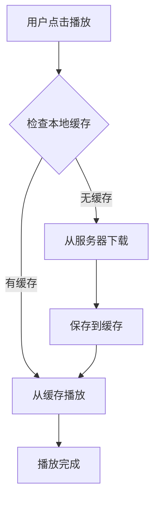
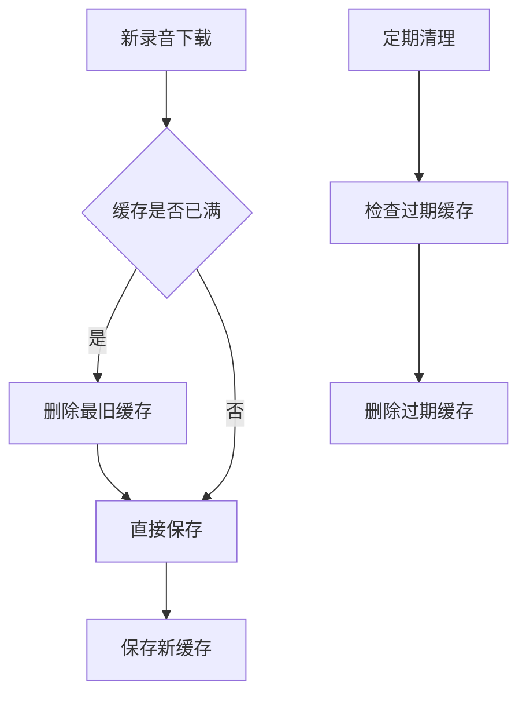

# 音频缓存优化功能

## 功能概述

为了提高录音播放的性能和用户体验，我们实现了智能的音频缓存系统。该系统会在本地缓存已下载的录音文件，避免重复的网络请求，显著提升播放速度。

## 核心特性

### 1. 智能缓存策略
- **首次播放**: 从服务器下载录音并缓存到本地
- **后续播放**: 直接从本地缓存播放，无需网络请求
- **自动过期**: 缓存24小时后自动清理
- **容量管理**: 最多缓存50个录音文件，超出时自动删除最旧的

### 2. 全局缓存管理
- **跨组件共享**: 所有录音组件共享同一个缓存
- **内存优化**: 自动释放不需要的URL对象
- **状态监控**: 实时显示缓存使用情况

### 3. 用户体验优化
- **播放状态指示**: 显示"播放中..."状态
- **缓存状态显示**: 右下角显示缓存使用情况
- **一键清理**: 支持手动清空所有缓存

## 技术实现

### 缓存管理器 (`AudioCacheManager`)

```typescript
class AudioCacheManager {
  private cache = new Map<string, { blob: Blob; url: string; timestamp: number }>();
  private maxCacheSize = 50; // 最大缓存数量
  private maxAge = 24 * 60 * 60 * 1000; // 24小时过期时间
}
```

### 主要方法

- `generateKey(lyricId, word?, lineNumber?)` - 生成缓存键
- `get(key)` - 获取缓存（自动检查过期）
- `set(key, blob, url)` - 设置缓存
- `delete(key)` - 删除缓存
- `cleanup()` - 清理过期缓存
- `clear()` - 清空所有缓存

### 缓存键格式

- 单词录音: `word_{lyricId}_{word}`
- 整句录音: `line_{lyricId}_{lineNumber}`

## 使用流程

### 1. 播放录音流程



### 2. 缓存管理流程



## 性能优化

### 1. 网络优化
- **减少请求**: 缓存命中时无需网络请求
- **带宽节省**: 避免重复下载相同录音
- **响应速度**: 本地播放几乎无延迟

### 2. 内存优化
- **自动清理**: 过期缓存自动删除
- **容量限制**: 防止内存无限增长
- **URL释放**: 及时释放Blob URL

### 3. 用户体验优化
- **即时播放**: 缓存命中时立即播放
- **状态反馈**: 清晰的播放状态指示
- **缓存管理**: 可视化的缓存状态

## 缓存状态指示器

### 位置
- 右下角固定位置
- 半透明背景，不干扰主要内容

### 显示内容
- 当前缓存数量: `缓存: 5/50`
- 状态指示: 绿色圆点表示有缓存，灰色圆点表示无缓存
- 详细信息: 点击展开显示缓存状态和使用情况

### 操作功能
- **查看详情**: 点击显示缓存统计
- **清空缓存**: 一键清空所有缓存
- **状态监控**: 实时更新缓存状态

## 配置参数

### 缓存设置
```typescript
const maxCacheSize = 50;        // 最大缓存数量
const maxAge = 24 * 60 * 60 * 1000; // 过期时间（24小时）
const cleanupInterval = 60 * 60 * 1000; // 清理间隔（1小时）
```

### 可调整参数
- **缓存大小**: 根据设备内存调整
- **过期时间**: 根据使用频率调整
- **清理频率**: 根据性能需求调整

## 故障排除

### 常见问题

1. **缓存不生效**
   - 检查浏览器是否支持Blob API
   - 确认缓存键生成正确
   - 查看控制台错误信息

2. **内存占用过高**
   - 减少最大缓存数量
   - 缩短过期时间
   - 手动清空缓存

3. **播放失败**
   - 检查网络连接
   - 确认录音文件完整性
   - 尝试清空缓存重新下载

### 调试方法

1. **查看缓存状态**
   ```javascript
   console.log(audioCache.getStats());
   ```

2. **检查特定缓存**
   ```javascript
   const key = audioCache.generateKey(lyricId, word);
   console.log(audioCache.get(key));
   ```

3. **手动清理缓存**
   ```javascript
   audioCache.clear();
   ```

## 最佳实践

### 1. 缓存策略
- 优先缓存用户经常播放的录音
- 定期清理不常用的缓存
- 根据设备性能调整缓存大小

### 2. 用户体验
- 提供清晰的缓存状态反馈
- 支持手动缓存管理
- 优化播放状态指示

### 3. 性能监控
- 监控缓存命中率
- 跟踪内存使用情况
- 分析播放性能指标

## 总结

音频缓存优化功能显著提升了录音播放的性能和用户体验：

- **性能提升**: 减少网络请求，提高播放速度
- **用户体验**: 即时播放，状态清晰
- **资源优化**: 智能缓存管理，内存友好
- **可维护性**: 模块化设计，易于扩展

该功能为语言学习应用提供了更好的音频播放体验，帮助用户更高效地练习发音。 